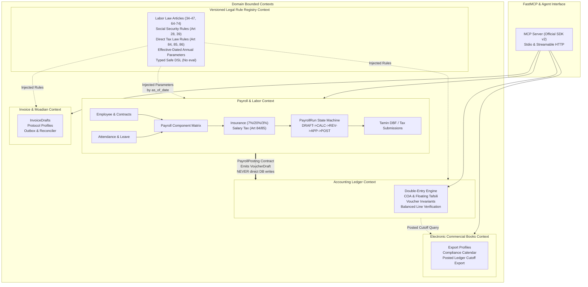

# HesabYar-AI — Final Implementation Architecture

**Architecture ID:** HYA-A1-FINAL  
**Version:** 1.5.0-ARCH  
**Date:** 2026-09-20  
**State:** `ARCH_UPDATE`  
**Pinned F0 Baseline SHA:** `76c26f2f188310bcc178d9e955e4faf0706fcbef` (tag: `v0.1.0-f0-frozen`)  
**Scope:** Normative implementation specification for the core accounting ledger, versioned accounting standards, Iranian tax policy registry, payroll, labor, social security insurance, salary tax, electronic commercial books compliance, electronic invoice / Moadian integration, document intake, advisory analytics, and FastMCP / Agent interface.

> This is the **single normative architecture document for implementation**.
>
> The coding agent MUST implement from this file. It MUST NOT infer implementation rules from research notes, old architecture drafts, README prose, sample data, or external unverified sources.
>
> If any other repository file conflicts with this document, **this document wins**. A future architecture change is valid only when both:
> 1. this file is version-bumped and updated; and
> 2. a new ADR records the reason and trade-offs.
>
> No ADR, research note, commit message, README section, or code comment may silently override this file.

---

# 0. Executive decision

HesabYar-AI is architected as a **modular monolith with explicit bounded contexts, domain invariants, and ports/adapters (hexagonal architecture)**.

The system enforces six distinct, non-overlapping kinds of truth:

1. **Accounting Invariants** — deterministic, transactional double-entry ledger truth.
2. **Accounting Standards** — versioned professional rules with source provenance (Audit Organization of Iran / سازمان حسابرسی).
3. **Tax & Labor Legal Policy** — effective-dated, source-backed statutory rules (Direct Tax Law, Labor Law, Social Security Law).
4. **Payroll & Labor Sub-ledger** — contract, attendance, leave, component matrix, social security assessment, and salary withholding calculations producing draft journal vouchers.
5. **External Government Protocol Behavior** — versioned technical integration contracts (Moadian protocol profiles, Tamin insurance diskette specifications, Tax portal submission files).
6. **Regulatory Filing & Compliance Boundaries** — immutable snapshot exports and compliance calendar deadlines.

The LLM/MCP layer is strictly an orchestration and operational interface. It is **never** the source of financial truth, legal truth, authorization, tenant identity, or mathematical calculation.

The entire system is designed to **fail closed** on financial, legal, security, calculation, or transmission uncertainty.

---

# 1. Authority hierarchy and source policy

## 1.1 Repository authority order

For all implementation decisions, this hierarchy is absolute:

1. `docs/ARCHITECTURE.md` — this file.
2. Accepted ADRs in `docs/adr/`.
3. Accepted tests in `tests/` verifying architecture invariants.
4. Production source code in `src/hesabyar/`.
5. Versioned source snapshots registered by legal/standards/protocol registries.
6. README, operational documentation, and reference skills in `skills/`.
7. Research notes, examples, and exploratory scripts.

Items 6–7 are explanatory and discovery aids only. They are not normative.

## 1.2 External source hierarchy

For all tax, labor, insurance, accounting, and government protocol facts:

1. Official statute enacted by the Islamic Consultative Assembly (مجلس شورای اسلامی), Supreme Labor Council decrees (مصوبات شورای عالی کار), Cabinet decrees (تصویب‌نامه‌های هیئت وزیران), General Assembly of the Administrative Court verdicts (آراء هیئت عمومی دیوان عدالت اداری), official INTA circulars (بخشنامه‌های سازمان امور مالیاتی), or official Social Security Organization regulations (دستورالعمل‌های سازمان تامین اجتماعی).
2. Official gazette / legal portal archive with identifiable document number, gazette date, and effective window.
3. Official technical specification document published by tax or social security administrative bodies.
4. Trusted secondary copy used strictly to discover and retrieve the primary official gazette copy.
5. Unofficial commentary, social media, blogs, or tax consultant interpretations — discovery evidence only; strictly prohibited from executing in production logic.

A source is never `VERIFIED` merely because multiple secondary websites or blogs repeat it.

## 1.3 Required legal source record

Every legal statute, circular, standard, and protocol profile used by production logic MUST possess an immutable registry record:

```text
source_id: UUID
domain: tax | accounting_standard | labor_law | social_security | moadian_protocol
authority: string
document_number: string
title: string
published_at: date (Gregorian)
effective_from: date (Gregorian)
effective_to: date | null
retrieved_at: timestamp (UTC)
canonical_url: string
snapshot_path: string (hash-addressed file path)
sha256: hex string (64 chars)
verification_status: VERIFIED | CORROBORATED | DISCOVERY_ONLY | DISPUTED | RETIRED | PENDING_UPDATE
supersedes_source_id: UUID | null
verified_by: string (actor identifier)
verified_at: timestamp | null (UTC)
notes: string
```

### 1.3.1 Permitted verification statuses

- `VERIFIED`: Primary source document obtained, cryptographic hash matched, official gazette / document number verified by an authorized human reviewer. Executable in production.
- `CORROBORATED`: Multiple official or semi-official copies match, but primary gazette scan is pending final verification. May execute only in staging/simulation with explicit warnings. Prohibited in production.
- `DISCOVERY_ONLY`: Secondary mention or draft policy under review. Blocked from execution.
- `DISPUTED`: Conflicting legal interpretations exist (e.g., conflicting Administrative Court rulings or pending Council of Ministers decrees). Requires explicit human review; fails closed in automated runs.
- `RETIRED`: Superseded by subsequent statute, circular, or annual decree. Inactive for new periods, retained for historical re-evaluation.
- `PENDING_UPDATE`: Annual cycle pending official publication (e.g., annual housing allowance awaiting Cabinet approval). Fails closed with `RULE_PENDING_UPDATE`.

**Fail-Closed Execution Rule:** Production logic may only execute source records with `verification_status = VERIFIED`. Any missing, unverified, or disputed rule halts automated calculation with `RULE_UNVERIFIED`.

---

# 2. Bounded Context Architecture & System Seams

HesabYar-AI enforces strict DDD boundaries between accounting invariants, legal policy, payroll operational management, and external reporting.

## 2.1 Bounded Context Map (ASCII)

```text
+----------------------------------------------------------------------------------------------------+
|                                    FastMCP & Agent Interface                                        |
|                         (Tools: Read, Draft, Review, Post, Validate, Export)                       |
+----------------------------------------------------------------------------------------------------+
                                      |                             |
                                      v                             v
+------------------------------------------+   +-----------------------------------------------------+
|        Accounting Ledger Context         |   |                 Payroll & Labor Context             |
|                                          |   |                                                     |
| - Chart of Accounts (COA)                |   | - Employee Registry & Contracts                     |
| - Floating Tafsili Matrix                |   | - Attendance & Timesheet Normalization              |
| - Fiscal Years & Posting Periods         |   | - Leave Entitlement & Accrual                       |
| - Journal Vouchers & Balanced Lines      |   | - Multi-Axis Payroll Component Matrix               |
| - Dual Control Approvals                 |   | - Social Security Assessment (7% / 20% / 3%)        |
| - Sequence Allocator (No MAX+1)          |   | - Salary Tax Assessment (Art. 84/85 Brackets)       |
| - Trial Balance & Statement Checks       |   | - Dual-Control Payroll Run State Machine            |
|                                          |   | - Tamin DBF & Tax Portal Export Submissions         |
+------------------------------------------+   +-----------------------------------------------------+
                     ^                                                   |
                     |           PayrollPosting Contract                 |
                     +---------------------------------------------------+
                     | (Draft Balanced Journal Voucher via Port Adapter; |
                     |  Payroll NEVER writes directly to Ledger tables)  |
                     |                                                   |
                     v                                                   v
+------------------------------------------+   +-----------------------------------------------------+
|  Versioned Legal & Rule Registry Context |   |       Electronic Commercial Books Context           |
|                                          |   |                                                     |
| - Standard Revisions & Provenance        |   | - Compliance Calendar & Deadlines                   |
| - Effective-Dated Tax Rules & Brackets   |   | - Official Export Profiles & Schemas                |
| - Labor Law Thresholds & Wage Decrees    |   | - Posted Ledger Snapshot Extracts                   |
| - Social Security Rate & Ceiling Tables  |   | - Immutable Export Manifest & Hashes                |
| - Typed Safe Formula DSL (No eval)       |   +-----------------------------------------------------+
+------------------------------------------+                             |
                     |                                                   |
                     v                                                   v
+----------------------------------------------------------------------------------------------------+
|                              Invoice & Moadian Integration Context                                 |
|                                                                                                    |
| - InvoiceDrafts & Pattern Schemas (1..N)        - Transactional Outbox Worker                      |
| - Versioned Moadian Protocol Profiles           - Simulator & Reconciler                           |
| - TaxID Generation & Crypto Ports               - Explicit Human Approval Gate                     |
+----------------------------------------------------------------------------------------------------+
```

## 2.2 Bounded Context Map (Mermaid)



## 2.3 Deterministic Seam: Ledger ↕ Payroll Contract

The integration seam between Payroll and the General Ledger is strictly decoupled:

1. **Zero Direct Database Cross-Talk:** The Payroll domain module and its repositories have zero knowledge of Ledger SQLAlchemy tables or direct table writes. It cannot perform `INSERT INTO vouchers` or update account balances.
2. **The `PayrollPosting` Contract:**
   - When a `PayrollRun` reaches the `APPROVED` state through dual-control authorization, an application service invokes the `PayrollLedgerPostingPort`.
   - The port generates a `PayrollPosting` value object representing a balanced double-entry `VoucherDraft`.
   - The voucher maps payroll components to moein/tafsili accounts according to the tenant's configured payroll accounting map:
     - **Debit:** Direct Labor Wage Expense (هزینه حقوق و دستمزد مستقیم), Indirect Labor Expense, Employer Social Security Expense (23% = 20% employer + 3% unemployment), Employer Severance Provision (ذخیره مزایای پایان خدمت).
     - **Credit:** Salary Payable to Employees (حقوق پرداختنی / پرسنل), Employee Social Security Payable to Tamin (بیمه پرداختنی ۷٪ سهم کارگر + ۲۳٪ سهم کارفرما), Salary Withholding Tax Payable to INTA (مالیات حقوق پرداختنی ماده ۸۶), Discretionary Deductions / Loan Repayments Payable.
3. **Double-Entry Balance Guarantee:** The emitted draft voucher must strictly obey `sum(debit) == sum(credit)`.
4. **Ledger Invariant Processing:** The Ledger domain receives the `VoucherDraft` through its standard application entry point (`create_voucher_draft`), executing its own period-open checks, account validity checks, tafsili constraints, and sequence allocation.

---

# 3. Physical module layout and dependency rules

The codebase adheres to clean hexagonal modularity. The module layout extends `src/hesabyar/` as follows:

```text
src/hesabyar/
  domain/
    common/
      money.py               # MoneyIRR (int-backed, no float)
      dates.py               # FiscalDate (Gregorian canonical, Jalali display)
      ids.py                 # Strongly-typed UUID wrappers
      errors.py              # Application error hierarchy
      result.py              # Result[T, E] monad
      context.py             # TenantContext & ActorContext
    ledger/
      entities.py           # Account, Voucher, VoucherLine, Approval
      value_objects.py      # AccountCode, VoucherNumber
      services.py           # Balance verification, reversal logic
      ports.py              # LedgerRepositoryPort, SequencePort
    standards/
      models.py             # StandardRevision, ValidationRule
      dsl.py                # AST-based safe rule evaluator (No eval)
      ports.py              # StandardsRegistryPort
    tax_policy/
      models.py             # LegalSource, LegalRuleVersion, PolicyDecision
      decisions.py          # Policy decision structures
      handlers.py           # Effective-dated statutory handlers
      ports.py              # TaxRuleRepositoryPort
    payroll/                # NEW IN v1.5.0-ARCH
      entities.py           # Employee, EmploymentContract, PayrollRun, PayrollLine
      value_objects.py      # NationalCode, SocialSecurityNumber, ContractTerms
      attendance.py         # AttendanceRecord, Timesheet, LeaveRecord
      matrix.py             # PayrollComponentMatrix, ComponentAxisDefinition
      assessment.py         # InsuranceAssessment, SalaryTaxAssessment
      posting.py            # PayrollPosting, COAMappingConfig
      submissions.py        # TaminDbfSpec, TaxPortalListSpec
      events.py             # PayrollComplianceEvent
      ports.py              # PayrollRepositoryPort, AttendancePort, PostingPort
    electronic_books/
      models.py             # ExportProfile, CalendarEvent, BookExport
      ports.py              # ElectronicBooksPort
    invoices/
      entities.py           # InvoiceDraft, InvoiceLine, InvoiceApproval
      ports.py              # InvoiceRepositoryPort
    documents/
      models.py             # DocumentMetadata, ExtractionCandidate
      ports.py              # DocumentStoragePort

  application/
    commands/
      ledger_commands.py
      payroll_commands.py   # RunPayroll, ApprovePayroll, PostPayrollVoucher
      invoice_commands.py
    queries/
      payroll_queries.py    # GetPayrollSummary, GetEmployeePayslip, GetTaminReport
    services/
      payroll_service.py    # Orchestration of attendance -> matrix -> assessment -> posting
    authorization.py
    transaction.py

  infrastructure/
    persistence/
      postgres/
        models.py           # SQLAlchemy declarative mappings (Ledger, Payroll, Tax)
        repositories.py     # Tenant-isolated repository implementations
        payroll_repos.py    # Payroll, Employee, Contract, Run repositories
        uow.py              # Unit of Work
    payroll/
      tamin_dbf_writer.py   # Deterministic DBM/DBF serializer (IRAN-SYSTEM / Windows-1256)
      tax_portal_writer.py  # INTA electronic salary tax file serializer
    standards/
    tax_policy/
    electronic_books/
    moadian/
    auth/

  interfaces/
    mcp/
      server.py             # Official MCP Python SDK v2 MCPServer
      tools_read.py
      tools_write.py
      tools_tax.py
      tools_payroll.py      # FastMCP payroll calculation, review, and posting tools
    cli/
      main.py

tests/
  unit/
    payroll/
  property/
  integration/
    payroll/
  contract/

skills/
  iran-payroll-insurance/   # Progressive Agent Skill scaffold
```

## 3.1 Dependency direction rules

Permitted:
- `interfaces -> application -> domain`
- `infrastructure -> domain (satisfying ports)`
- `payroll application services -> ledger ports (emitting VoucherDraft)`

Strictly Forbidden:
- Domain modules importing infrastructure, SQLAlchemy, or MCP.
- Domain modules performing I/O or reading environment variables.
- Payroll domain directly importing Ledger infrastructure or executing database mutations on ledger tables.
- Accounting ledger depending on payroll or employee structures.
- Presentation/MCP layers bypassing application services.

---

# 4. Core value objects and arithmetic invariants

## 4.1 Money (`MoneyIRR`)
- Internal representation: Python `int` only.
- Canonical currency: Iranian Rial (IRR).
- Conversion to Toman: Presentation-layer display only (`amount // 10`). Never stored in domain models or database columns.
- Float construction: Strictly forbidden.
- Database type: `BIGINT`.

## 4.2 Rates, Percentages, and Decimal Arithmetic
- All statutory rates, overtime multiples, shift coefficients, and tax percentages MUST use `decimal.Decimal`.
- Database type: `NUMERIC` with explicit scale and precision.
- Float arithmetic is strictly prohibited across the entire financial and payroll domain.

## 4.3 Rounding Invariants in Payroll
Every statutory calculation step must explicitly specify its rounding mode:
- **Social Security Calculations:** Rounded to nearest integer Rial using `ROUND_HALF_UP` (or statutory truncations defined by active Tamin circulars).
- **Salary Tax Calculations:** Taxable bases are truncated or rounded per Article 85 regulations and annual budget decrees.
- Every assessment record must store:
  ```text
  rounding_mode: string (e.g., "ROUND_HALF_UP", "ROUND_FLOOR")
  rounding_scale: int (0 for Rial)
  rule_version: string
  ```

## 4.4 Canonical Dates
- All domain timestamps: UTC `TIMESTAMPTZ`.
- Accounting and labor event dates: Gregorian `DATE` as primary storage.
- Jalali dates: Derived using `FiscalDate` for regulatory reporting, monthly periods, and legal decrees.
- Never use a Jalali text string as the sole persistent identity of a date.

---

# 5. Payroll Domain Model: Ubiquitous Language & Invariants

The Payroll context models employment, compensation, attendance, statutory levies, and regulatory submissions in full alignment with Iranian Labor and Tax jurisprudence.

## 5.1 Ubiquitous Language & Core Entities

### `Employee`
The natural person in an employment relationship with the tenant.
- Attributes: `employee_id` (UUID), `tenant_id` (UUID), `personnel_number` (string), `first_name` (string), `last_name` (string), `national_code` (NationalCode value object, validated via checksum), `social_security_number` (string), `birth_date` (FiscalDate), `hire_date` (FiscalDate), `termination_date` (FiscalDate | null), `status` (`ACTIVE | ON_LEAVE | SUSPENDED | TERMINATED`), `is_foreign_national` (bool), `marital_status` (`SINGLE | MARRIED`), `dependent_children_count` (int, non-negative).
- Invariants:
  - `national_code` must satisfy the Iranian National ID modulo-11 algorithm (for Iranian nationals).
  - An employee belongs strictly to one tenant.
  - Active employment requires at least one active `EmploymentContract`.

### `EmploymentContract`
The legally binding contract under Labor Law Articles 7–20.
- Attributes: `contract_id` (UUID), `employee_id` (UUID), `tenant_id` (UUID), `contract_number` (string), `contract_type` (`PERMANENT | FIXED_TERM | PROJECT_BASED | APPRENTICESHIP`), `job_title` (string), `job_code` (string), `effective_from` (FiscalDate), `effective_to` (FiscalDate | null), `probation_period_days` (int), `daily_base_wage` (MoneyIRR), `monthly_base_salary` (MoneyIRR), `working_hours_scheme` (`STANDARD_44H | SHIFT_ROTATING | PART_TIME`), `contract_status` (`DRAFT | ACTIVE | EXPIRED | TERMINATED`).
- Invariants:
  - `daily_base_wage` cannot be less than the verified statutory minimum daily wage for the contract's effective date.
  - `effective_to` is required for `FIXED_TERM` and must be greater than or equal to `effective_from`.
  - Permanent contracts cannot have `effective_to` populated unless terminated with an authorized legal event.

### `PayrollPeriod`
The accounting and regulatory time box for wage calculation.
- Attributes: `period_id` (UUID), `tenant_id` (UUID), `fiscal_year_id` (UUID), `period_number` (int, 1–12 for standard solar months), `jalali_year` (int, e.g., 1404, 1405), `jalali_month` (int, 1–12: Farvardin to Esfand), `start_date` (FiscalDate), `end_date` (FiscalDate), `calendar_days` (int: 31 for months 1–6, 30 for months 7–11, 29/30 for month 12), `official_working_days` (int), `official_holidays` (int), `status` (`OPEN | CALCULATING | CLOSED | LOCKED`).
- Invariants:
  - Jalali calendar bounds must match Iranian astronomical calendar definitions.
  - A period cannot be closed until all associated `PayrollRun` records are either `POSTED` or `CANCELLED`.

### `Attendance` & `Timesheet`
Operational time and attendance records.
- `AttendanceRecord`: Atomic daily event per employee (date, entry_time, exit_time, regular_hours, overtime_hours, night_hours, holiday_hours, delay_minutes, early_departure_minutes, absence_flag).
- `Timesheet`: Monthly aggregation per employee for a `PayrollPeriod`:
  - `standard_worked_hours` (Decimal)
  - `worked_days` (int)
  - `overtime_hours` (Decimal)
  - `night_work_hours` (Decimal)
  - `friday_work_hours` (Decimal)
  - `shift_type` (`NONE | TWO_SHIFT_DAY | TWO_SHIFT_NIGHT | THREE_SHIFT`)
  - `absence_days` (int)
  - `mission_days` (int)
  - `status` (`DRAFT | SUBMITTED | VERIFIED | REJECTED`)
- Invariants:
  - Total worked days plus absence days plus paid leave days cannot exceed period calendar days.

### `Leave`
Leave administration governed by Labor Law Articles 64–74.
- `LeaveRecord`: `leave_id`, `employee_id`, `leave_type` (`ANNUAL_ENTITLED | SICK | MATERNITY | MARRIAGE_BEREAVEMENT | UNPAID | COMPENSATORY`), `start_date`, `end_date`, `duration_days`, `approval_status`, `medical_cert_ref`.
- Invariants:
  - Annual entitled leave is 26 working days per year (Labor Law Art. 64), accrued at ~2.16 days per worked month.
  - Maximum annual leave balance carry-forward to the subsequent year is strictly capped at 9 days (Labor Law Art. 66).
  - Sick leave endorsed by Tamin medical commissions is paid by Social Security, not the employer's operational wage fund (Labor Law Art. 74).
  - Maternity leave is 9 months paid by Social Security.

### `PayrollComponent`
A parameterized earnings, deduction, or employer contribution item.
- Attributes: `component_id` (UUID), `code` (string, e.g., `BASE_WAGE`, `HOUSING`, `GROCERY`, `CHILD`, `OVERTIME`), `name_fa` (string), `classification` (`EARNING | DEDUCTION | EMPLOYER_CONTRIBUTION`), `formula_key` (string), `is_statutory` (bool), `matrix_config` (PayrollComponentMatrix).

### `PayrollRun`
The aggregate root orchestrating a batch calculation for a tenant and period.
- Lifecycle States:
  ```text
  DRAFT -> CALCULATED -> REVIEWED -> APPROVED -> POSTED
    |          |            |           |
    +----------+------------+-----------+-> CANCELLED
  ```
- Attributes: `run_id` (UUID), `tenant_id` (UUID), `period_id` (UUID), `run_number` (int), `calculation_timestamp` (TIMESTAMPTZ), `status` (PayrollRunStatus), `total_gross_pay` (MoneyIRR), `total_deductions` (MoneyIRR), `total_net_pay` (MoneyIRR), `total_employer_insurance` (MoneyIRR), `total_employee_insurance` (MoneyIRR), `total_salary_tax` (MoneyIRR), `input_hash` (string), `calculation_hash` (string).
- State Machine Rules:
  1. `DRAFT`: Initial creation; inputs and attendance linked.
  2. `CALCULATED`: Component matrix and statutory assessments evaluated; lines populated.
  3. `REVIEWED`: Operational payroll specialist confirms lines, payslips, and compliance checks.
  4. `APPROVED`: Requires explicit dual-control authorization (`PayrollApproval`). Hash locked.
  5. `POSTED`: Draft journal voucher emitted to Ledger via `PayrollPosting` port; ledger voucher confirmed. The payroll run becomes permanently immutable.
  6. `CANCELLED`: Terminal cancellation of unposted runs.

### `PayrollLine`
Per-employee breakdown of components within a `PayrollRun`.
- Attributes: `line_id` (UUID), `run_id` (UUID), `employee_id` (UUID), `contract_id` (UUID), `worked_days` (int), `base_wage_amount` (MoneyIRR), `allowances_amount` (MoneyIRR), `overtime_amount` (MoneyIRR), `bonus_amount` (MoneyIRR), `gross_pay` (MoneyIRR), `insurance_assessable_base` (MoneyIRR), `tax_assessable_base` (MoneyIRR), `employee_insurance_deduction` (MoneyIRR), `salary_tax_deduction` (MoneyIRR), `other_deductions` (MoneyIRR), `net_pay` (MoneyIRR), `employer_insurance_cost` (MoneyIRR), `employer_severance_provision` (MoneyIRR).
- Invariants:
  - `gross_pay = base_wage_amount + allowances_amount + overtime_amount + bonus_amount`
  - `net_pay = gross_pay - (employee_insurance_deduction + salary_tax_deduction + other_deductions)`
  - All amounts must be non-negative integers (`MoneyIRR`).

### `PayrollApproval`
Dual-control authorization record.
- Attributes: `approval_id` (UUID), `run_id` (UUID), `first_approver_id` (UUID), `first_approved_at` (TIMESTAMPTZ), `second_approver_id` (UUID), `second_approved_at` (TIMESTAMPTZ), `canonical_run_hash` (string).
- Invariant: `first_approver_id != second_approver_id` (Segregation of Duties).

### `PayrollPosting`
The contract object emitted to the Ledger context.
- Attributes: `posting_id` (UUID), `run_id` (UUID), `tenant_id` (UUID), `fiscal_year_id` (UUID), `posting_date` (FiscalDate), `ledger_voucher_draft` (VoucherDraft payload), `posted_voucher_id` (UUID | null), `posted_at` (TIMESTAMPTZ | null).

### `InsuranceAssessment`
Social Security assessment line under Social Security Law Articles 28, 36, and 39.
- Attributes: `assessment_id`, `employee_id`, `period_id`, `assessable_earnings` (MoneyIRR), `employee_share_7pct` (MoneyIRR), `employer_share_20pct` (MoneyIRR), `unemployment_share_3pct` (MoneyIRR), `total_contribution_30pct` (MoneyIRR), `is_exempt_from_unemployment` (bool), `statutory_ceiling_applied` (bool).
- Invariants:
  - `assessable_earnings` is capped at the verified statutory maximum (7 × minimum daily wage × period days) and cannot fall below minimum wage for full-time work.
  - `employee_share_7pct = assessable_earnings * 0.07`
  - `employer_share_20pct = assessable_earnings * 0.20`
  - `unemployment_share_3pct = assessable_earnings * 0.03`
  - Total employer levy: `23% = 20% + 3%`.

### `SalaryTaxAssessment`
Direct Tax Law Articles 84 and 85 progressive withholding calculation.
- Attributes: `assessment_id`, `employee_id`, `period_id`, `taxable_gross_income` (MoneyIRR), `statutory_exemptions` (MoneyIRR: e.g., 2/7th employee insurance per Circular 232/24013/d, non-taxable welfare allowances), `taxable_net_base` (MoneyIRR), `monthly_exemption_threshold` (MoneyIRR), `net_tax_withheld` (MoneyIRR), `bracket_breakdown` (JSON array of bracket evaluations).
- Invariants:
  - Monthly tax exemption = Annual Article 84 ceiling / 12.
  - Progressive marginal rates apply strictly to increments above exemption ceilings.

### `PayrollSubmission`
Official regulatory reporting artifacts.
- Types:
  1. `TAMIN_DISKETTE`: Monthly Social Security list files (`DSKWOR00.DBF` for employee master data and `DSKKAR00.DBF` for monthly payroll assessment data).
  2. `TAX_PORTAL_LIST`: INTA monthly salary tax withholding submission (XML / CSV / JSON per active INTA specification).
- Attributes: `submission_id`, `run_id`, `artifact_type`, `file_format`, `content_hash`, `generated_at`, `validation_status`.

### `PayrollComplianceEvent`
Immutable audit log tracking all labor contracts, wage changes, run executions, and regulatory filings.

---

# 6. Payroll Component Matrix Schema & Specifications

## 6.1 The Fundamental Architectural Ban

> **EXPLICIT ARCHITECTURAL BAN:**  
> The system MUST NEVER assume or infer that `is_insurance_assessable == is_taxable`.  
> Conflating these two concepts is a fatal compliance defect. Every compensation item possesses an independent, multi-axis profile governed by distinct statutory authorities.

## 6.2 Multi-Axis Classification Schema

Every payroll item is evaluated across 11 orthogonal boolean axes:

1. `is_wage_base` (مزد مبنا / مزد شغل): Base wage component used for labor statutory multipliers.
2. `is_insurance_assessable` (مشمول کسر حق بیمه تامین اجتماعی): Subject to 7% employee and 23% employer Social Security contributions under Social Security Law Art. 28.
3. `is_taxable` (مشمول مالیات بر درآمد حقوق): Included in gross taxable income under Direct Tax Law Art. 82/83.
4. `is_overtime_base` (مبنای اضافه کاری): Included in base hourly wage for overtime calculation (Labor Law Art. 59).
5. `is_night_base` (مبنای شب کاری): Included in base hourly wage for 35% night work premium (Labor Law Art. 58).
6. `is_shift_base` (مبنای نوبت کاری): Included in base wage for shift coefficients (10%, 15%, 22.5% under Labor Law Art. 56).
7. `is_friday_base` (مبنای جمعه کاری): Included in base wage for 40% Friday work premium (Labor Law Art. 62).
8. `is_severance_base` (مبنای حق سنوات پایان کار): Included in base wage for severance pay of at least 30 days wage per year of service (Labor Law Art. 24 & 31).
9. `is_eidi_base` (مبنای عیدی و پاداش سالانه): Included in base wage for legal New Year bonus (60 days wage up to 90 days minimum wage ceiling).
10. `is_leave_settlement_base` (مبنای بازخرید مانده مرخصی): Base wage rate used when compensating unused entitled annual leave upon termination (Labor Law Art. 71).
11. `is_employer_cost` (هزینه بالاسری کارفرما): Represents an employer-borne cost above gross pay (e.g., employer insurance, severance accrual).

## 6.3 Standard Iranian Payroll Component Matrix

The canonical component configuration is codified below. Note the deliberate divergence between insurance and tax columns:

| Component Code | Component Name (Fa) | Statutory Reference | `wage_base` | `ins_assess` | `taxable` | `ot_base` | `night_base` | `shift_base` | `fri_base` | `sev_base` | `eidi_base` | `leave_base` | `emp_cost` |
|---|---|---|:---:|:---:|:---:|:---:|:---:|:---:|:---:|:---:|:---:|:---:|:---:|
| `BASE_WAGE` | مزد شغل / پایه | Labor Law Art. 35/36 | **TRUE** | **TRUE** | **TRUE** | **TRUE** | **TRUE** | **TRUE** | **TRUE** | **TRUE** | **TRUE** | **TRUE** | FALSE |
| `SENIORITY_BONUS` | پایه سنوات | SLC Annual Decree | **TRUE** | **TRUE** | **TRUE** | **TRUE** | **TRUE** | **TRUE** | **TRUE** | **TRUE** | **TRUE** | **TRUE** | FALSE |
| `HOUSING_ALLOWANCE` | حق مسکن | Cabinet Decree | FALSE | **TRUE** | **EXEMPT*** | FALSE | FALSE | FALSE | FALSE | FALSE | FALSE | FALSE | FALSE |
| `GROCERY_ALLOWANCE` | بن خواربار / کارگری | SLC Annual Decree | FALSE | **TRUE** | **EXEMPT*** | FALSE | FALSE | FALSE | FALSE | FALSE | FALSE | FALSE | FALSE |
| `CHILD_ALLOWANCE` | حق اولاد | Labor Law Art. 86 | FALSE | FALSE | **TRUE** | FALSE | FALSE | FALSE | FALSE | FALSE | FALSE | FALSE | FALSE |
| `MARRIAGE_ALLOWANCE` | حق تاهل | SLC Decree (from 1403) | FALSE | **TRUE** | **TRUE** | FALSE | FALSE | FALSE | FALSE | FALSE | FALSE | FALSE | FALSE |
| `OVERTIME_PAY` | اضافه کاری | Labor Law Art. 59 | FALSE | **TRUE** | **TRUE** | FALSE | FALSE | FALSE | FALSE | FALSE | FALSE | FALSE | FALSE |
| `SHIFT_PAY` | نوبت کاری | Labor Law Art. 56 | FALSE | **TRUE** | **TRUE** | FALSE | FALSE | FALSE | FALSE | FALSE | FALSE | FALSE | FALSE |
| `NIGHT_PREMIUM` | شب کاری | Labor Law Art. 58 | FALSE | **TRUE** | **TRUE** | FALSE | FALSE | FALSE | FALSE | FALSE | FALSE | FALSE | FALSE |
| `FRIDAY_PREMIUM` | جمعه کاری | Labor Law Art. 62 | FALSE | **TRUE** | **TRUE** | FALSE | FALSE | FALSE | FALSE | FALSE | FALSE | FALSE | FALSE |
| `MISSION_ALLOWANCE` | فوق العاده ماموریت | Labor Law Art. 46 | FALSE | FALSE | **EXEMPT** | FALSE | FALSE | FALSE | FALSE | FALSE | FALSE | FALSE | FALSE |
| `PERFORMANCE_BONUS` | پاداش بهره وری | Employment Contract | FALSE | **TRUE** | **TRUE** | FALSE | FALSE | FALSE | FALSE | FALSE | FALSE | FALSE | FALSE |
| `EIDI_BONUS` | عیدی و پاداش سالانه | Eidi Law 1370 | FALSE | FALSE | **PARTIAL***| FALSE | FALSE | FALSE | FALSE | FALSE | FALSE | FALSE | FALSE |
| `SEVERANCE_PAY` | حق سنوات پایان خدمت | Labor Law Art. 24 | FALSE | FALSE | **EXEMPT** | FALSE | FALSE | FALSE | FALSE | FALSE | FALSE | FALSE | FALSE |
| `LEAVE_SETTLEMENT` | بازخرید مانده مرخصی | Labor Law Art. 71 | FALSE | FALSE | **EXEMPT** | FALSE | FALSE | FALSE | FALSE | FALSE | FALSE | FALSE | FALSE |
| `EMPLOYER_INS_20` | بیمه سهم کارفرما ۲۰٪ | Social Security Art. 28 | FALSE | FALSE | FALSE | FALSE | FALSE | FALSE | FALSE | FALSE | FALSE | FALSE | **TRUE** |
| `UNEMPLOYMENT_INS_3`| بیمه بیکاری ۳٪ | Unemployment Ins. Law | FALSE | FALSE | FALSE | FALSE | FALSE | FALSE | FALSE | FALSE | FALSE | FALSE | **TRUE** |

*\*Statutory Notes on Tax Exemptions:*
- `HOUSING_ALLOWANCE` & `GROCERY_ALLOWANCE`: Non-taxability is established by verdicts of the General Assembly of the Administrative Court (e.g., Ruling No. 1957 and Ruling No. 140009970905811257 / Circular 200/1401/10) recognizing welfare and motivation benefits as non-taxable under Art. 83, up to reasonable statutory limits.
- `EIDI_BONUS`: Taxable only on amounts exceeding the annual Article 84 exemption threshold (one month equivalent of annual tax exemption).
- `MISSION_ALLOWANCE`: Non-taxable up to statutory limits supported by official travel orders and attendance proof.

---

# 7. Required Legal Families & Annual Parameters Modeling

## 7.1 Labor Law (قانون کار) Statutory Invariants

1. **Standard Working Hours (ساعات کار موظف):**
   - Article 51: Standard weekly working hours are strictly **44 hours** per week.
   - Monthly base hours divisor: In standard Iranian payroll practice, the nominal monthly divisor for hourly rate calculation is `44 hours / 6 days = 7.3333 hours/day` (7 hours and 20 minutes). Over 30 days: `30 * 7.3333 = 220 hours`. (Alternatively `365 / 12 / 7 * 44 = 191.29 hours` depending on collective bargaining agreement; parameter must be versioned per tenant).
   - Hourly Wage Rate: `Daily Base Wage / 7.333333`.
2. **Overtime Work (اضافه کاری - Article 59):**
   - Multiplier: **140%** of regular hourly wage (`Regular Hourly Wage * 1.40`).
   - Conditions: Consent of worker, maximum 4 hours per day (except emergency situations).
3. **Night Work Premium (فوق‌العاده شب کاری - Article 58):**
   - Multiplier: **135%** (additional 35% premium for non-shift workers working between 22:00 and 06:00).
4. **Shift Work Premiums (فوق‌العاده نوبت کاری - Article 56):**
   - Rotating between Morning & Afternoon (صبح و عصر): **110%** (+10%).
   - Rotating between Morning, Afternoon & Night (صبح، عصر و شب): **115%** (+15%).
   - Rotating between Morning & Night OR Afternoon & Night (صبح و شب یا عصر و شب): **122.5%** (+22.5%).
5. **Friday Work Premium (فوق‌العاده جمعه کاری - Article 62):**
   - Multiplier: **140%** (regular work on Friday incurs a 40% premium, provided another day of the week is granted as mandatory rest).
6. **Mission Allowance (فوق‌العاده ماموریت - Article 46):**
   - Must not be less than one day's base wage per day of mission, plus transport costs. Minimum distance: 50 km from primary workplace or requiring overnight stay.
7. **Annual Eidi & New Year Bonus (قانون تعیین عیدی و پاداش سالانه - ۱۳۷۰):**
   - Formula: 60 days of base wage per full year of service.
   - Statutory Ceiling: 90 days of statutory minimum daily wage.
   - Proration: Workers with less than 12 months service receive `(60 * Daily Wage / 365) * Worked Days`, capped at the prorated ceiling.
8. **Severance Pay (حق سنوات پایان کار - Articles 24 & 31):**
   - Formula: At least 30 days of the most recent base wage per full year of service upon termination, retirement, or contract expiration.

## 7.2 Social Security Law (قانون تامین اجتماعی) Statutory Invariants

1. **Contribution Rates (Article 28):**
   - Employee share: **7%** of assessable earnings.
   - Employer share: **20%** of assessable earnings.
   - Unemployment insurance share (employer-borne): **3%** of assessable earnings.
   - Total Social Security Levy: **30%** (7% employee, 23% employer).
2. **Statutory Contribution Ceiling & Floor (سقف و کف دستمزد مشمول بیمه):**
   - Floor: Cannot be lower than the approved minimum daily wage for the period.
   - Ceiling: **7 times** the statutory minimum daily wage. Assessable earnings exceeding this ceiling are exempt from insurance deduction.
3. **Filing & Payment Deadlines (Article 39):**
   - Monthly list and full contribution payment must be transmitted to Tamin by the **last day of the following calendar month** (e.g., Ordibehesht 31 for Farvardin wages).

## 7.3 Direct Tax Law (قانون مالیات‌های مستقیم) Statutory Invariants

1. **Taxable Base (Articles 82 & 83):**
   - Taxable salary includes base pay, overtime, and taxable benefits minus statutory exemptions.
2. **Annual Tax Exemption (Article 84):**
   - Defined annually in the State Budget Law (قانون بودجه کل کشور).
   - Monthly exemption is calculated as `Annual Exemption / 12`.
3. **Progressive Tax Brackets (Article 85):**
   - Governed by progressive bracket tables defined in the annual Budget Law (rates typically span 10%, 15%, 20%, 25%, 30%).
   - Marginal calculation: Each bracket applies strictly to the incremental portion of earnings within that bracket.
4. **Social Security Employee Share Tax Exemption:**
   - Pursuant to Circular No. 232/24013/d and tax jurisprudence, **2/7ths** of the 7% employee Social Security deduction (representing health and medical insurance) is fully deductible from gross taxable income before applying Article 85 brackets.
5. **Filing & Withholding Deadline (Article 86):**
   - Employers must submit the monthly salary tax withholding return and remit taxes to the tax authority by the **last day of the following calendar month**.

## 7.4 Versioned Annual Parameters (داده‌های متغیر سالانه)

All annual parameters are strictly externalized into versioned YAML / database records:

```yaml
# Schema of annual parameters
schema_version: "1.0"
year: 1405
effective_from: "2026-03-21"
effective_to: "2027-03-20"
authority: "شورای عالی کار و قانون بودجه ۱۴۰۵"
parameters:
  daily_minimum_wage_irr: 0               # To be populated from official decree
  other_levels_increase_percent: 0.0      # E.g., 22.0%
  other_levels_daily_fixed_irr: 0         # Fixed addition in Rials
  monthly_housing_allowance_irr: 0        # Requires Cabinet approval
  monthly_grocery_allowance_irr: 0        # Approved by SLC
  daily_seniority_base_irr: 0             # Per day after 1 year of service
  monthly_child_allowance_per_child_irr: 0# 3x daily minimum wage per child
  monthly_marriage_allowance_irr: 0       # Married employees
  insurance_ceiling_multiplier: 7         # 7x minimum wage
  annual_tax_exemption_ceiling_irr: 0     # Art. 84 Budget Law
  tax_brackets: []                        # Array of threshold/rate pairs
```

---

# 8. Progressive Skill Loading Architecture for AI Agents

To optimize token efficiency, eliminate hallucinations, and enforce strict execution boundaries:

1. **Decoupled Architecture:** AI agents do not evaluate financial math directly. Domain calculations are performed by deterministic Python engines in `src/hesabyar/domain/payroll/`.
2. **Modular Skill Scaffolding:** Domain-specific compliance rules are decomposed into progressive skills under `skills/`:
   - `skills/hesabyar-project-control`: Architecture governance, phase stop-gates, ADR tracking.
   - `skills/iran-accounting-standards`: Standards revisions, chart of accounts, balance sheet validation rules.
   - `skills/iran-tax-compliance`: Corporate tax, VAT, Article 6, Article 100, capital gains.
   - `skills/iran-payroll-insurance`: Iranian Labor Law, Social Security circulars, salary tax brackets, component matrices, and validation tooling.
   - `skills/iran-electronic-books`: Commercial books schemas, compliance calendar events.
   - `skills/iran-moadian`: FastMCP protocol profiles, invoice patterns, simulator fixtures.

## 8.1 Detailed Specification: `skills/iran-payroll-insurance/`

```text
skills/iran-payroll-insurance/
  SKILL.md                           # Skill metadata, trigger conditions, Diataxis guidance
  agents/
    openai.yaml                      # FastMCP / Assistant interface configuration
  references/
    labor-law-index.md               # Summary of Articles 34-47, 51-63, 64-74 with source IDs
    social-security-index.md         # Articles 28, 36, 39, ceiling and diskette rules
    salary-tax-index.md              # Articles 82-86, 2/7th exemption, Administrative Court rulings
    payroll-components.yaml          # Canonical 11-axis matrix definition
    annual-1405.yaml                 # 1405 statutory parameter schemas (zero hardcoding)
    source-status.md                 # Live status of legal gazettes and pending decrees
  scripts/
    validate_sources.py              # Cryptographic verification of reference snapshots
    validate_parameters.py           # Integrity check for annual parameter YAML schemas
    diff_annual_rules.py             # Delta analysis between consecutive solar years
    check_source_freshness.py        # Verification of gazette freshness and expiration dates
```

**Prohibition for Skill Scripts:** Skill scripts in `skills/iran-payroll-insurance/scripts/` are strictly **validation, schema-checking, and freshness-auditing tools**. They MUST NOT contain business payroll calculation engines or database mutation code.

---

# 9. Ledger Bounded Context Specification

The General Ledger context maintains transactional authority over all financial balances.

## 9.1 Core Entities & Hierarchy
- `Tenant`: Multi-tenant root.
- `FiscalYear`: Boundary of financial accounting (open/closed).
- `PostingPeriod`: Monthly or custom period within a fiscal year.
- `Account`: Chart of Accounts organized by Group (گروه), General/Kol (کل), and Subsidiary/Moein (معین).
- `Tafsili`: Independent floating analytical dimension (e.g., individual employee, supplier, cost center).
- `AccountTafsiliLink`: Explicit many-to-many link table governing which Tafsili types may attach to a given Moein account.
- `Voucher`: Journal voucher header (`DRAFT | REVIEW_REQUIRED | APPROVED | POSTED | REVERSED`).
- `VoucherLine`: Atomic debit or credit line attached to a voucher.
- `NumberSequence`: Transaction-safe atomic sequence allocator.

## 9.2 Transactional Invariants
- **Double-Entry Balance:** Every posted voucher must strictly obey:
  $$\sum \text{Debit} = \sum \text{Credit} > 0$$
- **Line Exclusivity:** Every `VoucherLine` has `debit XOR credit` non-zero. Negative amounts are strictly prohibited.
- **Posting Immutability:** Once a voucher transitions to `POSTED`, neither the voucher nor its lines may be updated or deleted. Corrections require a reversing voucher (`REVERSED`) and a new replacement voucher.
- **Sequence Allocator:** `voucher_number` is generated using a database-locked sequence row per `(tenant_id, fiscal_year_id)`. `MAX(voucher_number)+1` is strictly forbidden.

---

# 10. Accounting Standards Bounded Context

## 10.1 Standard Version Registry
Each accounting standard revision tracks: `standard_number`, `revision_id`, `published_at`, `effective_from`, `effective_to`, `source_id`, `status`, `supersedes_revision_id`.

## 10.2 Strict 1405 Standard Gates
- **Standard 43 (Revenue from Contracts with Customers):** Effective for periods beginning 1404/01/01 and later; supersedes Standards 3, 9, and 29.
- **Standard 44 (Leases):** Effective for periods beginning 1405/01/01 and later; supersedes Standard 21.
- **Standard 15 (Investments):** The legacy bundled text is blocked for 1405+ until the official revised-1404 source is imported and marked `VERIFIED`.
- **Standard 35 (Income Taxes):** Handles deferred taxes and tax accounting. Standard 22 is Interim Financial Reporting.

## 10.3 Typed Safe Formula DSL (Zero Eval)
All standards balance-sheet and disclosure checks execute through an AST-based safe evaluator (`src/hesabyar/domain/standards/dsl.py`).
- Prohibitions: No `eval()`, no `exec()`, no dynamic imports, no attribute access on non-dict objects.
- Invariant: A formula that cannot be evaluated yields `Result.failure(EvaluationError)` and invalidates the report. It never silently passes.

---

# 11. Tax/Legal Policy Bounded Context

The Tax Policy context handles corporate tax, VAT, Article 6, and Article 100 decision support.

## 11.1 Interface Contract
```python
evaluate(
    policy_id: PolicyId,
    facts: PolicyFacts,
    as_of_date: date,
) -> PolicyDecision
```
`as_of_date` is mandatory for every evaluation.

## 11.2 Advisory Safety Boundary
The tax policy engine outputs recommendations and risk assessments. It NEVER issues direct criminal conclusions (e.g., alleging tax evasion under Article 274) or automatically mutates ledger tables.

---

# 12. Electronic Commercial Books Context

Provides immutable export profiles and compliance calendar tracking for mandatory electronic books submissions under 1405 regulations.
- `ExportProfile`: Schema versions, mapping profiles, validation gates.
- `ComplianceCalendarEvent`: Deadlines, affected taxpayer classes, statutory references.
- Exports are deterministic extracts of posted ledger states and produce tamper-evident SHA-256 manifests.

---

# 13. Invoice Domain & Moadian Protocol Profiles

- Canonical business draft: `InvoiceDraft`.
- External government payload: Governed by versioned `MoadianProtocolProfile`.
- Discovery status: Technical instruction version 7.9 (Tir 1405) is tracked as a discovery signal and must be verified against an official gazette copy before production activation.

---

# 14. External Submission Workflow & Transactional Outbox

- Submissions to external tax or insurance endpoints use a **Transactional Outbox**.
- Human authorization gate: An approved operator must record an immutable approval hash before an invoice or report can be enqueued.
- FastMCP tools cannot grant their own production tax submission approvals.

---

# 15. Document Intake & Security

- Extracted document text (OCR/PDF) is treated as **untrusted data**.
- Prompt-Injection Boundary: Document text is never concatenated into agent system instructions.
- File security: Strict MIME validation, decompression limits, and isolated temporary paths.

---

# 16. FastMCP & Agent Interface Specification

## 16.1 Official SDK v2 & Transports
- Target: Official MCP Python SDK v2 (`MCPServer`).
- Transports: Local `stdio` and Remote `Streamable HTTP` (`/mcp`). Legacy HTTP+SSE is strictly prohibited.
- Protocol spec target: MCP 2026-07-28.

## 16.2 Authentication & Tenant Derivation
- Remote MCP requests authenticate via Bearer tokens (OAuth2 / OIDC).
- Tenant ID and Actor ID are extracted strictly from validated claims. They are never accepted as tool input parameters.

## 16.3 Payroll MCP Tools
In addition to ledger and tax tools, FastMCP exposes dedicated payroll tools:
- `payroll_calculate_run`: Calculates a draft run for a given period and tenant.
- `payroll_review_run`: Reviews payroll lines, insurance assessments, and tax withholdings.
- `payroll_approve_run`: Records dual-control operator approvals.
- `payroll_post_to_ledger`: Emits the balanced journal voucher draft to the Ledger context.
- `payroll_generate_tamin_diskette`: Exports validated Social Security DBF diskette files.
- `payroll_generate_tax_submission`: Exports the official INTA monthly salary tax list.

---

# 17. Security, Secrets, and PII Governance

- Private keys (e.g., Moadian cryptographic keys) are accessed strictly through a `KeyProvider` port; never stored in business tables or logged.
- PII Protection: National Codes, Social Security numbers, bank account numbers, and salary amounts are masked in logs and audit summaries.
- Production feature flags fail closed (`HESABYAR_PROD_MOADIAN_ENABLED=false`, `HESABYAR_ALLOW_UNVERIFIED_RULES=false`).

---

# 18. Audit Architecture

Every mutating event generates an immutable audit record:
- Event ID, tenant ID, actor ID, command, object ID, request ID.
- Pre-mutation hash, post-mutation hash, canonical input hash.
- Active legal source and rule versions.
- Cryptographic hash chain linking each audit entry to its predecessor.

---

# 19. Complete Database Model (PostgreSQL 16+)

Minimum required tables across all bounded contexts:

```text
-- Tenant & Identity
tenants
actors

-- Accounting Ledger Context
fiscal_years
posting_periods
accounts
tafsilis
account_tafsili_links
number_sequences
vouchers
voucher_lines
voucher_approvals

-- Accounting Standards Context
standard_sources
standard_revisions
validation_rules
validation_rule_versions

-- Tax Policy Context
legal_sources
legal_rules
legal_rule_versions
policy_decisions

-- Payroll & Labor Context (NEW IN v1.5.0-ARCH)
employees
employment_contracts
payroll_periods
attendance_records
timesheets
leave_records
payroll_components
payroll_component_matrices
payroll_runs
payroll_lines
payroll_approvals
payroll_postings
insurance_assessments
salary_tax_assessments
payroll_submissions
payroll_compliance_events

-- Electronic Commercial Books Context
electronic_book_profiles
compliance_calendar_events
electronic_book_exports

-- Invoice & Moadian Integration Context
moadian_protocol_profiles
invoice_drafts
invoice_lines
invoice_approvals
integration_outbox
moadian_transmissions
moadian_status_events

-- Document Intake Context
documents
document_extractions

-- Idempotency & Audit
idempotency_keys
audit_events
```

### 19.1 Critical Unique Constraints
```text
accounts: UNIQUE(tenant_id, code)
tafsilis: UNIQUE(tenant_id, code)
vouchers: UNIQUE(tenant_id, fiscal_year_id, voucher_number)
voucher_lines: UNIQUE(voucher_id, line_number)
employees: UNIQUE(tenant_id, personnel_number)
employees: UNIQUE(tenant_id, national_code)
employment_contracts: UNIQUE(tenant_id, contract_number)
payroll_periods: UNIQUE(tenant_id, jalali_year, jalali_month)
payroll_runs: UNIQUE(tenant_id, period_id, run_number)
payroll_lines: UNIQUE(run_id, employee_id)
payroll_postings: UNIQUE(run_id)
idempotency_keys: UNIQUE(tenant_id, command_name, request_id)
integration_outbox: UNIQUE(tenant_id, idempotency_key)
```

---

# 20. Error Taxonomy

Stable application error codes across contexts:

## 20.1 Ledger Errors
- `LEDGER_UNBALANCED`
- `LEDGER_PERIOD_CLOSED`
- `LEDGER_ACCOUNT_NOT_FOUND`
- `LEDGER_TAFSILI_REQUIRED`
- `LEDGER_TAFSILI_NOT_ALLOWED`
- `LEDGER_POSTED_IMMUTABLE`
- `LEDGER_APPROVAL_REQUIRED`

## 20.2 Validation Errors
- `RULE_EVALUATION_ERROR`
- `RULE_SOURCE_UNVERIFIED`
- `RULE_INPUT_MISSING`
- `STANDARD_REVISION_UNKNOWN`
- `STANDARD_SOURCE_BLOCKED`

## 20.3 Tax Policy Errors
- `POLICY_RULE_UNVERIFIED`
- `POLICY_NEEDS_EVIDENCE`
- `POLICY_DATE_NOT_COVERED`
- `POLICY_REVIEW_REQUIRED`

## 20.4 Electronic Books Errors
- `BOOKS_PROFILE_UNVERIFIED`
- `BOOKS_PERIOD_NOT_COVERED`
- `BOOKS_EXPORT_VALIDATION_FAILED`
- `COMPLIANCE_DEADLINE_UNKNOWN`

## 20.5 Moadian Errors
- `PROTOCOL_PROFILE_NOT_ACTIVE`
- `PROTOCOL_SCHEMA_UNSUPPORTED`
- `INVOICE_VALIDATION_FAILED`
- `INVOICE_APPROVAL_REQUIRED`
- `INVOICE_APPROVAL_STALE`
- `SUBMISSION_DISABLED`
- `SUBMISSION_AMBIGUOUS`
- `PENDING_RECONCILIATION`
- `REMOTE_REJECTED`

## 20.6 Payroll & Labor Errors (NEW IN v1.5.0-ARCH)
- `PAYROLL_RUN_NOT_FOUND`
- `PAYROLL_RUN_INVALID_STATE`
- `PAYROLL_RULE_UNVERIFIED`
- `EMPLOYEE_NOT_FOUND`
- `EMPLOYEE_INACTIVE`
- `CONTRACT_EXPIRED`
- `CONTRACT_MINIMUM_WAGE_VIOLATION`
- `ATTENDANCE_RECORD_MISSING`
- `ATTENDANCE_PERIOD_MISMATCH`
- `LEAVE_BALANCE_EXCEEDED`
- `UNBALANCED_POSTING_VOUCHER`
- `DUAL_APPROVAL_REQUIRED`
- `DUAL_APPROVAL_SAME_ACTOR`
- `PAYROLL_POSTING_ALREADY_EXISTS`
- `TAMIN_DISKETTE_ENCODING_ERROR`
- `TAX_PORTAL_SCHEMA_VIOLATION`

---

# 21. Implementation Sequence & Updated Stop Gates (F0 to F9)

The project roadmap is structured into 10 deterministic stages:

```text
F0 (Foundation) [FROZEN]
  --> F1 (Ledger)
    --> F2 (Versioned Rules)
      --> F3 (Payroll & Labor)
        --> F4 (Electronic Books)
          --> F5 (Invoice Domain)
            --> F6 (Moadian Verification & Simulator)
              --> F7 (MCP & Agent Interface)
                --> F8 (Production Moadian Adapter)
                  --> F9 (Advisory Analytics & AI)
```

### Stage F0 — Foundation (FROZEN at `76c26f2f188310bcc178d9e955e4faf0706fcbef`)
- Package structure, uv lockfile, PostgreSQL/Alembic scaffolding, Tenant/Actor context, MoneyIRR, FiscalDate, Result monad, safe standards AST evaluator.
- **STOP GATE F0:** All unit and PostgreSQL isolation tests green. (PASSED & FROZEN).

### Stage F1 — Accounting Ledger
- Chart of Accounts hierarchy, floating Tafsili links, fiscal years/periods, voucher lifecycle (`DRAFT` to `POSTED`), sequence allocation, trial balance, audit hash chain.
- **STOP GATE F1:** Property and database constraint tests green. No posted record can be modified or unbalanced.

### Stage F2 — Versioned Legal & Accounting Rule Registry
- Legal source snapshot store, standard revision registry, legal rule versions, typed tax policy evaluation framework, historical `as_of_date` golden tests.
- **STOP GATE F2:** Fail-closed evaluation verified. No unverified rule version may execute.

### Stage F3 — Payroll, Labor, Social Insurance & Salary Tax (NEW STAGE)
- Employee master registry, employment contracts, attendance/timesheet normalization, leave accrual, 11-axis component matrix, Social Security 7%/20%/3% calculation, Direct Tax Law Art. 84/85 progressive withholding, dual-control payroll run state machine, draft voucher posting contract (`PayrollPosting`), and Tamin DBF / Tax portal export serializers.
- **STOP GATE F3:** Full golden-file payroll test suite green. Zero float arithmetic. Emitted draft vouchers strictly balanced. Social Security and salary tax assessments independently verified.

### Stage F4 — Electronic Commercial Books
- Compliance calendar registry, versioned export profiles, deterministic posted ledger cutoffs, tamper-evident export manifests.
- **STOP GATE F4:** 1405 export profile validated against official technical specifications.

### Stage F5 — Invoice Domain
- Business invoice drafts, line items, versioning, review hash invalidation, protocol profile registry, offline schema validation.
- **STOP GATE F5:** Offline validation tests green; approval hashes invalidated on draft edit.

### Stage F6 — Moadian Verification + Simulator
- Pin official technical specification, verified protocol profile, contract fixtures, local test simulator, key-provider signing port, transactional outbox and reconciler.
- **STOP GATE F6:** Simulator passes all verified contract fixtures without calling external networks.

### Stage F7 — MCP / Agent Interface
- Official MCP Python SDK v2 implementation, stdio transport, Streamable HTTP transport, token authentication, tenant claim derivation, read/write/tax/payroll tool surfaces.
- **STOP GATE F7:** Remote security tests green. No unauthenticated endpoints. No legacy SSE.

### Stage F8 — Production Moadian Gateway Adapter
- Verified crypto/tax-ID algorithms, allowlisted endpoint adapter, response normalization, reconciliation worker.
- **STOP GATE F8:** Gated behind explicit owner-controlled production enablement flag.

### Stage F9 — Advisory, Analytics & AI Workflows
- Inflation-adjusted scenario modeling, working-capital analysis, tax-shield opportunity analysis, bank-statement reconciliation evidence classification.
- **STOP GATE F9:** Advisory outputs strictly non-posting and non-submitting.

---

# 22. Implementation Prohibitions & Known Gaps

## 22.1 Absolute Prohibitions for Coding Agents
1. Do NOT use Python `float` for any money, rate, tax, insurance, or attendance calculations.
2. Do NOT hard-code annual monetary amounts (minimum daily wage, housing allowance, grocery voucher, tax brackets) in Python code, database migrations, or schemas.
3. Do NOT permit the Payroll context to execute direct SQL inserts or updates against Ledger tables.
4. Do NOT use `eval()`, `exec()`, or dynamic imports for formula evaluation.
5. Do NOT use `MAX(id)+1` or `MAX(voucher_number)+1` for sequence allocation.
6. Do NOT permit unverified or disputed legal rules to execute in production runs.
7. Do NOT auto-approve production tax or payroll filings without explicit human dual-control records.
8. Do NOT concatenate raw OCR / document text into agent system prompts.
9. Do NOT accept tenant identity, actor roles, or database connection strings from LLM tool arguments.
10. Do NOT implement microservices, Kafka, Redis, or Celery in R0/R1.

## 22.2 Known Legal & Source Gaps (as of 2026-09-20)
1. **Cabinet Approval for 1405 Housing Allowance:** While the Supreme Labor Council sets wage parameters, the housing allowance (حق مسکن) legally requires formal ratification by the Council of Ministers (هیئت وزیران). If the decree is pending at the start of the solar year, the parameter is marked `PENDING_UPDATE` and calculation falls back to verified transitional guidance with an explicit audit warning.
2. **Administrative Court Disputes on Welfare Benefit Taxability:** Divergent rulings exist across various branches of the Administrative Court regarding whether fixed monthly cash payments of grocery coupons and housing allowances are fully exempt or exempt only up to specific caps. The system handles this via versioned policy profiles, defaulting to the conservative verified gazetted circular unless a tenant explicitly configures a court-precedent profile with professional sign-off.
3. **DBF Encoding Nuances for Tamin Diskettes:** The Social Security Organization's legacy desktop software relies on specific MS-DOS / Windows-1256 or IRAN-SYSTEM character encodings for `DSKWOR00.DBF` and `DSKKAR00.DBF`. Modern Linux/PostgreSQL UTF-8 strings must pass through a verified encoding translation adapter during diskette serialization.

---

# 23. Definition of Done for Any Critical Feature

A feature is complete only if:
- Domain model and invariants are fully enforced with strong typing.
- Calculations use `MoneyIRR` and `Decimal` with explicit rounding.
- Tenant isolation is verified at repository and database levels.
- Dual-control authorization is tested where required.
- Audit event generation and cryptographic hashes are verified.
- Error codes conform to the stable taxonomy.
- Unit, property, and integration tests pass cleanly with `pytest`.
- Type checking passes with `pyright` (0 errors).
- Linting passes with `ruff`.
- No sensitive PII or secrets leak into logs or exceptions.

---

# 24. Architecture Baseline Sign-off

```text
ARCHITECTURE_ID = HYA-A1-FINAL
ARCHITECTURE_VERSION = 1.5.0-ARCH
ARCHITECTURE_STATE = ARCH_UPDATE
F0_BASELINE_FROZEN_SHA = 76c26f2f188310bcc178d9e955e4faf0706fcbef
AUTHORIZED_STAGE = F0_FROZEN_STAGE_F1_PENDING
NEXT_IMPLEMENTATION_TARGET = STAGE_F1_LEDGER
```

**This document represents the sole authoritative architecture specification for HesabYar-AI v1.5.0-ARCH. All implementation work must strictly conform to these boundaries.**
